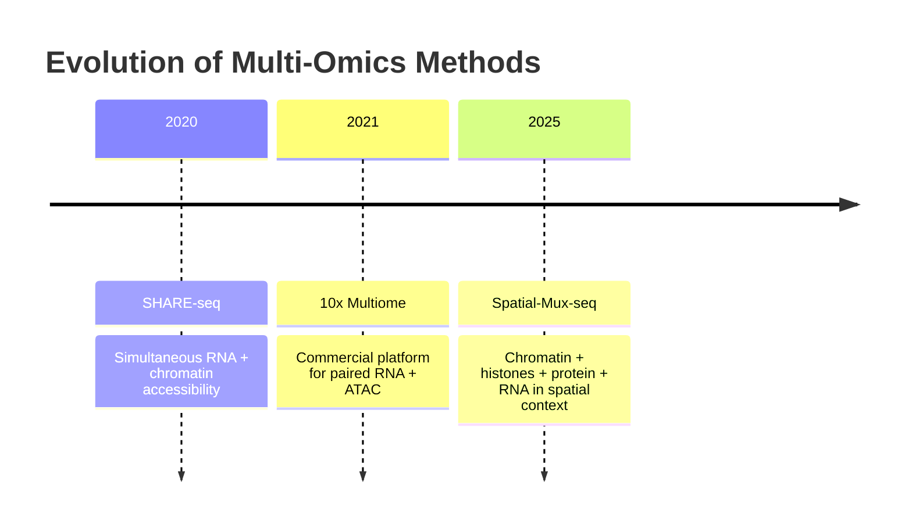

> **For the biologist who learned to code out of necessity:** This post traces how experimental breakthroughs in epigenetics inadvertently taught us computational thinking—before we even knew we were learning it.

---

## The Problem That Changed Everything

In 1992, Marianne Frommer faced what seemed like a simple question: how do you tell the difference between a methylated cytosine and an unmethylated one? Both are cytosines. Both look identical under a microscope. Both have the same mass on a spectrometer.

Her solution—treating DNA with sodium bisulfite to chemically convert unmethylated cytosines to uracils while leaving methylated cytosines untouched—became bisulfite sequencing, the gold standard for measuring DNA methylation. But here's what's fascinating: this experimental innovation forced biologists to start thinking computationally, whether they realized it or not.

Why? Because bisulfite sequencing doesn't give you a direct readout of methylation. It gives you sequences full of Ts (converted from unmethylated Cs) and Cs (originally methylated). Someone—or something—has to **infer** the original methylation state by comparing treated to untreated DNA.

> **Key Insight:** That inference step? That's computational thinking. The moment you have to reconstruct information from transformed data, you're already doing computation—even if you're just using Excel.
{: .block-tip }

---

## Decomposition: Breaking Down the Methylation Problem

Let's unpack what bisulfite sequencing actually requires you to do. This is where computational thinking starts: with **decomposition**—breaking a complex problem into manageable pieces.

**The experimental question:** "What is the methylation status of my genomic region?"

**The computational breakdown:**

1. Align bisulfite-converted reads to a reference genome (but the reads don't match perfectly anymore)
2. Identify which Cs became Ts (unmethylated sites)
3. Identify which Cs stayed Cs (methylated sites)
4. Calculate methylation percentage per site
5. Account for incomplete conversion (some Cs don't convert even if unmethylated)
6. Account for sequencing errors (some Ts might be sequencing mistakes, not conversions)

Each of these is its own computational problem. And here's the kicker: in the early days, biologists did steps 2-6 by hand, often using Excel. They were doing computational thinking without formal training.

### The Pattern Recognition Emerges

By the mid-2000s, researchers realized they were solving the same alignment problem over and over. Different labs were writing similar scripts. The community needed a standardized tool.

Enter **Bismark** (2011), which automated the entire pipeline. But Bismark didn't just automate existing manual steps—it introduced **abstraction**: the tool could handle single-end or paired-end reads, different reference genomes, various quality filters. One algorithm, many applications.

---

## Pattern Recognition: The Chromatin Accessibility Revolution

Fast forward to 2013. Jason Buenrostro at Stanford develops ATAC-seq (Assay for Transposase-Accessible Chromatin using sequencing). Instead of asking "where is DNA methylated?", he asks "where is chromatin accessible?"

The experimental approach is elegantly simple: a hyperactive transposase (Tn5) cuts DNA at accessible regions and simultaneously inserts sequencing adapters. Sequence the fragments, and you have a map of open chromatin.

But here's where **pattern recognition** becomes crucial. ATAC-seq doesn't just give you a list of open regions. It gives you:

- Read depth (how accessible is each region?)
- Fragment length distribution (are nucleosomes present?)
- Footprints (protected regions within accessible chromatin where transcription factors bind)

> **Pattern Recognition in Action:** Early ATAC-seq papers just counted peaks. Then researchers noticed patterns: certain genomic regions showed stereotypical fragment length distributions. A peak with many ~40-50bp fragments suggested nucleosome-free regions. Longer fragments (~200bp) indicated mononucleosomes.
{: .block-tip }

By 2016, tools like **NucleoATAC** were extracting nucleosome positioning and transcription factor occupancy from the same ATAC-seq data, because the patterns were there all along—they just needed algorithms to recognize them systematically.

The key insight: ATAC-seq fragment lengths aren't noise. They're data. But recognizing that required thinking computationally about what the experimental readout was actually telling you.

---

## Algorithmic Thinking: ChIP-seq and the Peak Calling Problem

Chromatin immunoprecipitation followed by sequencing (ChIP-seq) gives you a pile of DNA fragments representing where your protein of interest was bound. Your challenge: where, exactly, were the binding sites?

This is an **algorithmic thinking** problem: given noisy data with background signal, how do you systematically identify true binding events?

### Naive vs. Sophisticated Approaches

| ❌ **Naive Algorithm** | ✅ **Sophisticated Algorithm (MACS2)** |
|------------------------|----------------------------------------|
| 1. Align reads to genome | 1. Model local background using control samples |
| 2. Count reads in sliding windows | 2. Shift reads to estimate fragment centers |
| 3. Call regions with high counts as "peaks" | 3. Use dynamic lambda (local background rate) |
| 4. Done | 4. Calculate fold enrichment and statistical significance |
| *What early researchers did manually* | 5. Call peaks using FDR cutoff |
|  | 6. Report peak summits, not just regions |

Notice the difference? The sophisticated algorithm doesn't just count. It **models** the data generation process (how reads are created from fragments, how background varies locally) and uses that model to make better inferences.

> **This is algorithmic thinking:** Designing a step-by-step procedure that accounts for the structure of your problem.
{: .block-warning }

---

## Abstraction: Single-Cell Multi-Omics

Here's where epigenetics methods get really interesting computationally. By 2018, we had:

- scATAC-seq: single-cell chromatin accessibility
- scRNA-seq: single-cell gene expression  
- Single-cell bisulfite sequencing: single-cell methylation

Each generates sparse, noisy data. Each requires different computational approaches. But researchers started asking: what if we measured multiple epigenetic layers in the **same** cells?

### The Multi-Omics Explosion (2020-2025)

The computational challenge: these assays measure fundamentally different things. RNA-seq counts molecules. ATAC-seq measures accessibility. Methylation is binary at each CG site.

**Abstraction to the rescue:** Tools like **Signac** and **ArchR** introduced a unified framework.

**The Key Abstraction:**

All single-cell data can be represented as:

- **Cell × Feature matrix** (what you measure)
- **Metadata** (cell annotations, quality metrics)  
- **Dimensional reduction** (shared latent space)

Whether you have RNA counts, ATAC peaks, or methylation rates, this framework applies. The computational operations—normalization, feature selection, clustering, visualization—work on the abstract representation, not the raw data type.

This is abstraction: identifying common structure across different domains and building tools that work at that level of generality.

---

## The Deep Learning Revolution: When Pattern Recognition Meets Abstraction

### 2024: The Year Foundation Models Arrived in Epigenetics

Taskiran et al. (Nature, 2024) trained a deep learning model on single-cell ATAC-seq to learn enhancer grammar. Not "where are enhancers?" but "what makes an enhancer work?"

The model learned to:
- Design synthetic enhancers from scratch
- Predict cell-type specificity from sequence alone
- Generate minimal 50bp sequences that still function as enhancers

Meanwhile, Bravo González-Blas et al. (Nature Cell Biology, 2024) developed **DeepLiver**, which predicts how enhancer architecture encodes spatial identity in the liver. Single-nucleotide resolution. Experimentally validated.

### What's Computationally Different About Foundation Models?

<table class="table table-sm">
<thead>
<tr>
<th>Traditional Approaches</th>
<th>Foundation Model Approaches</th>
</tr>
</thead>
<tbody>
<tr>
<td>1. Design experiment 2. Collect data 3. Apply statistics 4. Interpret results</td>
<td>1. Train on millions of cells 2. Learn generalizable patterns 3. Generate predictions 4. Test predictions experimentally 5. Refine model</td>
</tr>
</tbody>
</table>

The model becomes the hypothesis generator. It discovers patterns humans wouldn't have designed experiments to test.

### But Here's the Critical Lesson from 2025

> **⚠️ Critical Computational Thinking:** Just because it's deep learning doesn't mean it's better.
>
> Ahlmann-Eltze et al. (Nature Methods, 2025) showed that foundation models for predicting gene perturbation responses didn't outperform simple baselines. The hype around AI in genomics needed rigorous benchmarking.
{: .block-danger }

This is **algorithmic evaluation**: don't just build fancy models. Ask:
- What is the simplest approach that would work? 
- How much better is your complex method? 
- Is the added complexity worth it?

---

## What Biologists Can Learn From This History

Every methods advance in epigenetics required computational thinking, even if the developers didn't call it that:

| Method | Computational Thinking Skill |
|--------|----------------------------|
| **Bisulfite sequencing (1992)** | Decomposition—breaking experimental readouts into inference steps |
| **ATAC-seq (2013)** | Pattern recognition—seeing signal in fragment length distributions |
| **ChIP-seq peak calling** | Algorithmic thinking—designing procedures that account for data structure |
| **Multi-omics (2020s)** | Abstraction—finding common frameworks across data types |
| **Foundation models (2024-2025)** | Critical evaluation—distinguishing transformative tools from hype |

---

## Practical Exercise: Think Through a Methods Paper Computationally

Next time you read a methods paper, ask yourself these questions:



**Decomposition:**
- What is the experimental readout, and what biological question does it answer?
- What are the steps from raw data to biological conclusion?
- Which steps are experimental? Which are computational?

**Pattern recognition:**
- What patterns in the data indicate signal vs. noise?
- Are there unexpected patterns the authors exploit (like ATAC-seq fragment lengths)?
- What assumptions about data structure does the analysis make?

**Algorithmic thinking:**
- What is the step-by-step procedure for going from reads to results?
- How does the algorithm handle edge cases (low coverage, ambiguous mappings, batch effects)?
- Could you describe the algorithm to someone else and they'd get the same results?

**Abstraction:**
- Does this method generalize beyond the specific application shown?
- What is the minimal necessary input? What is optional?
- Could the core approach be adapted to other biological questions?

**Evaluation:**
- How is this method benchmarked against alternatives?
- What are the failure modes? When would a simpler approach work just as well?
- Are the computational claims rigorously tested?



---

## The Computational Thinking You Already Have

If you've ever:

- ✓ Troubleshot why your Western blot didn't work (**decomposition**)
- ✓ Noticed that your ChIP peaks always appear near TSSs (**pattern recognition**)
- ✓ Written a step-by-step protocol (**algorithmic thinking**)
- ✓ Designed a cloning strategy that works for multiple constructs (**abstraction**)
- ✓ Tested whether you really need that expensive antibody (**evaluation**)

...then you're already thinking computationally. 

> **The transition to computational biology isn't learning to think differently.** It's learning to apply the problem-solving skills you already have to questions where the "experiment" is running code instead of pipetting samples.
{: .block-tip }

---

## Looking Forward: Programmable Biology

The most exciting methods papers in 2025 share a common thread: they're moving from *describing* biology to *programming* it.

**PERT** (Pierce et al., Nature, 2025)
: Prime editing that reads through stop codons, potentially treating dozens of genetic diseases with a single construct

**Perturb-FISH** (Binan et al., Cell, 2025)
: CRISPR screening with spatial transcriptomics, capturing cell-autonomous and intercellular effects simultaneously

**Base editing screens** (Multiple labs, 2024-2025)
: Connecting GWAS variants to functional outcomes at scale

These methods require sophisticated computational thinking at every step:
- Designing guide RNAs (**algorithmic design**)
- Analyzing spatial genetic interactions (**multi-dimensional pattern recognition**)
- Linking variants to phenotypes (**causal inference in high-dimensional space**)

The wet lab and the computational lab aren't separate anymore. Every experiment generates data that requires algorithmic interpretation. Every analysis makes assumptions about biology that should be experimentally validated.

---

## Epilogue: The Biologist's Advantage

The biologists who thrive in this environment won't necessarily be the ones who learn to code (though that helps). They'll be the ones who learn to think about biological problems the way Marianne Frommer thought about bisulfite sequencing: **as an inference problem where experimental design and computational analysis are inseparable.**

> **Remember:** When Frommer developed bisulfite sequencing in 1992, she wasn't trying to teach anyone computational thinking. She was just trying to measure methylation. But in solving that problem, she inadvertently created a method that would force an entire generation of biologists to think computationally.
>
> That's the beautiful irony: the best computational methods emerge not from trying to be computational, but from trying to answer biological questions well.
{: .block-tip }

---

## References & Further Reading

**Historical methods:**
- Frommer et al. (1992). "A genomic sequencing protocol that yields a positive display of 5-methylcytosine residues in individual DNA strands." *PNAS* 89(5):1827-1831.
- Buenrostro et al. (2013). "Transposition of native chromatin for fast and sensitive epigenomic profiling of open chromatin, DNA-binding proteins and nucleosome position." *Nature Methods* 10:1213–1218.

**Computational tools:**
- Krueger & Andrews (2011). "Bismark: a flexible aligner and methylation caller for Bisulfite-Seq applications." *Bioinformatics* 27(11):1571-1572.
- Zhang et al. (2008). "Model-based analysis of ChIP-Seq (MACS)." *Genome Biology* 9:R137.
- Schep et al. (2017). "chromVAR: inferring transcription-factor-associated accessibility from single-cell epigenomic data." *Nature Methods* 14:975–978.

**Modern multi-omics:**
- Ma et al. (2020). "Chromatin Potential Identified by Shared Single-Cell Profiling of RNA and Chromatin." *Cell* 183(4):1103-1116.
- Guo et al. (2025). "Spatial-Mux-seq: versatile spatial multiplexing of multi-omics modalities." *Nature Methods* 22:520–529.

**Foundation models & critical evaluation:**
- Taskiran, I.I. et al. (2024). "Cell-type-directed design of synthetic enhancers." *Nature* 626:212–220.
- Bravo González-Blas, C. et al. (2024). "Single-cell spatial multi-omics and deep learning dissect enhancer-driven gene regulatory networks in liver zonation." *Nature Cell Biology* 26(1):153-167.
- Ahlmann-Eltze, C. et al. (2025). "Comparison of transformers and simple baselines for predicting perturbation responses." *Nature Methods* 22:1657–1661.

**Programmable biology:**
- Pierce, S.E. et al. (2025). "Prime editing-installed suppressor tRNAs for disease-agnostic genome editing." *Nature* 648:191–202.
- Binan, L. et al. (2025). "Simultaneous CRISPR screening and spatial transcriptomics reveal intracellular, intercellular, and functional transcriptional circuits." *Cell* 188(8):2141-2158.

---

*This post is part of an ongoing series on computational thinking for experimental biologists. Next up: "How I Learned to Stop Worrying and Love the P-value: Statistical Thinking in Single-Cell Data."*